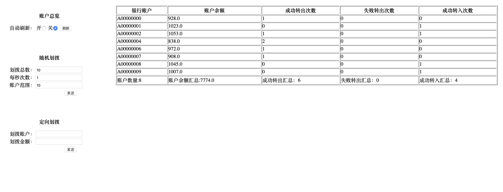

# 事中风控(1): 背景和业务介绍
## 前言
本篇是使用phoenix开发高性能事中风控服务系列第一篇，该系列一共分4篇文章介绍，本篇主要分析业务场景，梳理清楚服务职责。

- 第一篇：[背景和业务介绍](https://gitlab.iquantex.com/phoenix-public/phoenix-risk/tree/part-1)
- 第二篇：[phoenix工程搭建](https://gitlab.iquantex.com/phoenix-public/phoenix-risk/tree/part-2)
- 第三篇：[领域设计与消息定义](https://gitlab.iquantex.com/phoenix-public/phoenix-risk/tree/part-3)
- 第四篇：[领域对象定义](https://gitlab.iquantex.com/phoenix-public/phoenix-risk/tree/part-4)
- 第五篇：[客户端代码编写](https://gitlab.iquantex.com/phoenix-public/phoenix-risk/tree/part-5)

## 背景描述

目前金融资管一般都是把风控做到指令流程当中，这样严重依赖原本的指令系统。实际上如果可以做到实时的风控计算，即便是事中计算，也是可以做到很大程度的风险控制效果。当然风控的实时计算依赖很多状态数据，比如产品估值，产品头寸等，如果采用传统的面向数据库管理状态无法做到很好的实时性。

Phoenix是内存编程框架，很适合解决此类问题，下面选用`投资计划有效性`风控条款，分析条款规则和业务流程。

## 投资计划有效性

### 规则描述

`投资计划有效性`条款监控在每次指令下达时触发，主要监控该笔指令下的股票未来持仓占用总资产的比例，超过一定阈值则告警。业务范围这里简化只涉及沪深交易所的A股股票交易。

### 规则解析

（（在途数量 + 持仓数量） *   证券行情报价 + 指令金额 ） /  净资产  > 阈值    告警

持仓分为：持仓数量 (不区分冻结和可用)， 在途数量（指令买入未成交数量）

根据规则可以看出，风控服务需要实时维护`持仓数量`,`在途数量`和`产品净资产`状态。`实时行情`本案例先简单模拟，下面对涉及到的状态维护和业务流程做详细解析。

### 交易流程 
针对`投资计划有效性`规则内容，分析简化为下面业务流程
1. 股票买指令： 持仓数量不变，在途数量+，计算风控
2. 股票卖指令： 持仓数量不变
3. 股票买成交： 在途数量-，持仓数量+
4. 股票卖成交： 持仓数量-
5. 净资产变更： 净资产覆盖变更

## 架构设计
本案例是使用phoenix开发微服务，微服务本身会包含简单的下单页面，以及后端处理逻辑。同时也可以再phoenix-admin上查看事件上下文。

## 结尾

本篇从背景介绍和业务分析讲述了事中风控微服务的背景，下面将从pheonix服务搭建开始，一步一步完善事中风控微服务。
